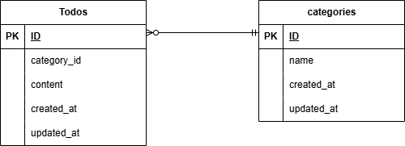

# Todoアプリ

## 環境構築

#### リポジトリをクローン

```
git clone git@github.com:koko-chii/todo4.git
```

#### Laravelのビルド

```
docker compose up -d --build
```

#### ディレクトリの移動

```
code src
```

#### PHPコンテナ内ログインと　Laravel パッケージのダウンロード

```
docker-compose exec php composer install
```

#### .env ファイルの作成

```
cp .env.example .env
```
#### .env ファイルの修正

```
MYSQL_DATABASE: laravel_db

MYSQL_USER: laravel_user

MYSQL_PASSWORD: laravel_pass
```

#### キー生成

```
php artisan key:generate
```

#### マイグレーション・シーディングを実行

```
docker-compose exec php bash -c "composer install && php artisan migrate --seed"

```

## 使用技術（実行環境）

フレームワーク：Laravel 8.83.8

言語：PHP 7.3 / 8.0 以上

Webサーバー：Nginx 1.21.1

データベース：MySQL 8.0.26

## ER図



## URL

アプリケーション：http://localhost/

phpMyAdmin：http://localhost:8080
